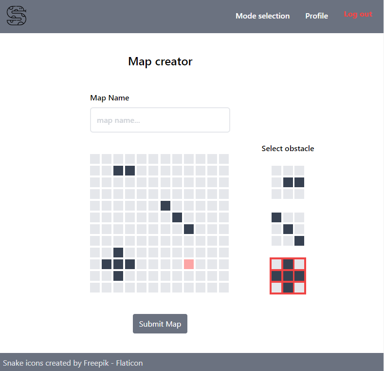

## Projekto užduotis

Projekto tikslas – suteikti galimybę kompiuterinių žaidimų žaidėjams pasivaržyti tarpusavyje bei 
smagiai praleisti laiką. 
Aplikacijos veikimo principas – internetinė svetainė susidės iš dviejų dalių:  
- klientinės dalies (angl. Front-end), kuri žaidėjams ar administratoriams bus pasiekiama per 
naršyklę. 
- serverinės dalies (angl. Back-end), kuri teiks API (angl. application programming interface) 
prieigą prie žaidimų, naudotojų valdymo. 

Naudotojas, prieš pradėdamas naudotis šia aplikacija, turės susikurt naują paskyrą ir su ja 
prisijungt. Prisijungęs galės peržiūrėti sužaistų žaidimų bendras statistikas, pasirinkti žaidimo 
režimą ir pradėti žaidimo paiešką, prisijungti prie vyksiančių turnyrų, kurti bei reitinguoti žaidimo 
žemėlapius. Administratorius galės sukurti naujus turnyrus, patvirtins sukurtus žemėlapius prieš juos 
paskelbiant visiems žaidėjams.

# Snake game

Multiplayer snake game that utilizes SignalR for real-time communication and JWT for player authentication.

## Prerequisites

- .NET 7.0+
- PostgreSQL database server
- Node v18.13.0+
- Node package manager: pnpm/npm/yarn

## Setup

- If you are using a package manager other than `pnpm`, update the `pnpm` commands in the `snake-game.csproj` file to match your chosen node package manager's commands.
- Install dotnet-ef: `$ dotnet tool install --global dotnet-ef`
- Update database to the last migration: `$ dotnet ef database update`

## Quick start

1. Start PostgreSQL server
2. Start backend:
    1. `$ cd backend`
    2. `$ dotnet run`
3. Start frontend:
    1. `$ cd frontend`
    2. `$ pnpm run dev`

## Troubleshooting

- If you encounter any issues while attempting to register or log in, consider: 
    1. creating a new user in PostgreSQL db server
    2. adjusting the connection string in the `appsettings.json` file accordingly

## Controls

- `w`, `a`, `s`, `d` or `arrow` keys - to change snake's movement direction

## Screenshots

Login page

  

Game mode selection page

  

In-game screen

  

Map creation page

  

