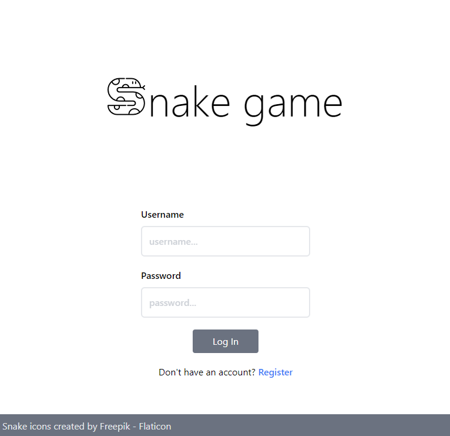
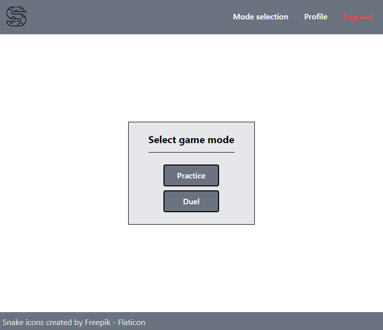
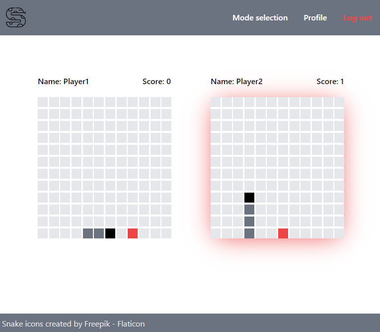

# Snake game

Multiplayer snake game that utilizes SignalR for real-time communication and JWT for player authentication.

## Prerequisites

- .NET 7.0+
- PostgreSQL database server
- node v18.13.0+
- pnpm/npm/yarn

## Setup

- If you are using a package manager other than `pnpm`, update the `pnpm` commands in the `snake-game.csproj` file to match your chosen node package manager's commands.
- Install dotnet-ef: `$ dotnet tool install --global dotnet-ef`
- Update database to the last migration: `$ dotnet ef database update`

## Quick start

- Start PostgreSQL server
- `$ dotnet run` (or run through visual studio)

## Troubleshooting

- If you encounter any issues while attempting to register or log in, consider: 
    1. creating a new user in PostgreSQL db server
    2. adjusting the connection string in the `appsettings.json` file accordingly

## Controls

- `w`, `a`, `s`, `d` or `arrow` keys - to change snake's movement direction

## Screenshots

Login page

  

Game mode selection page

  

In-game screen

  

